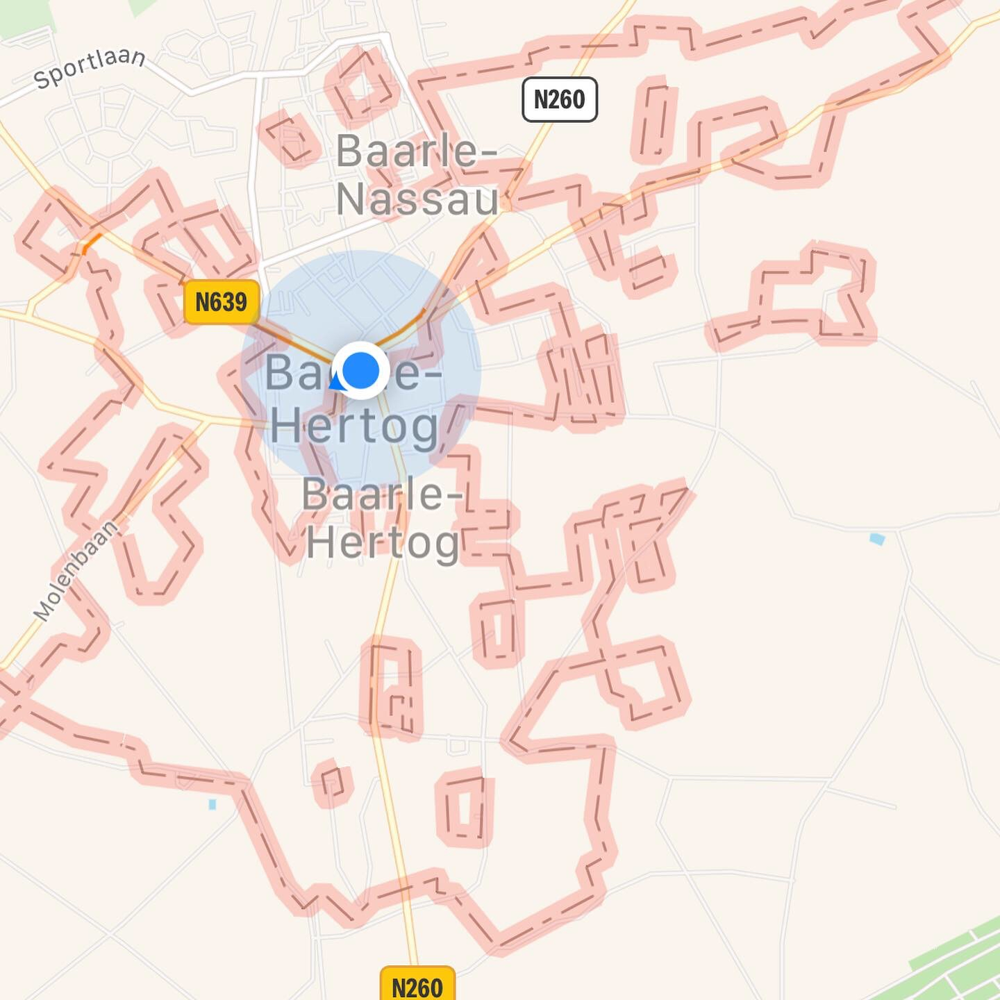
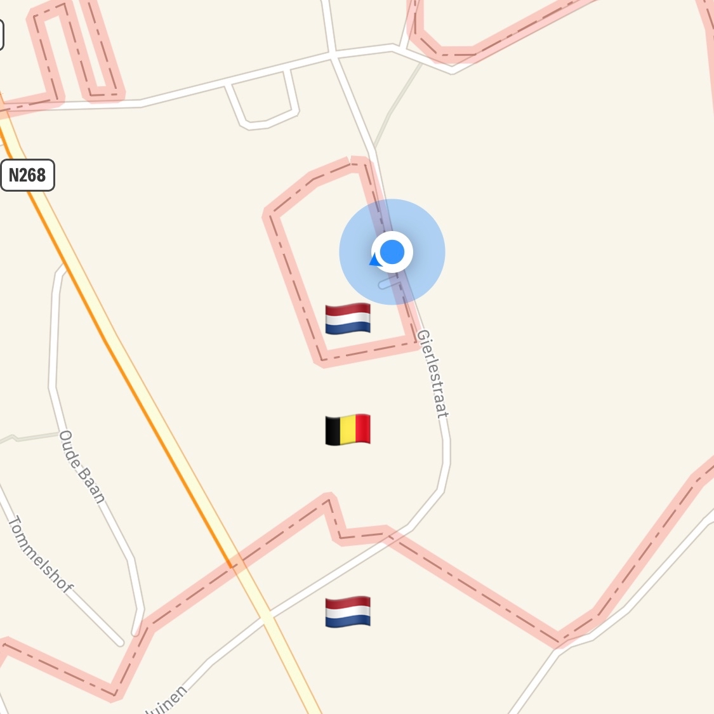
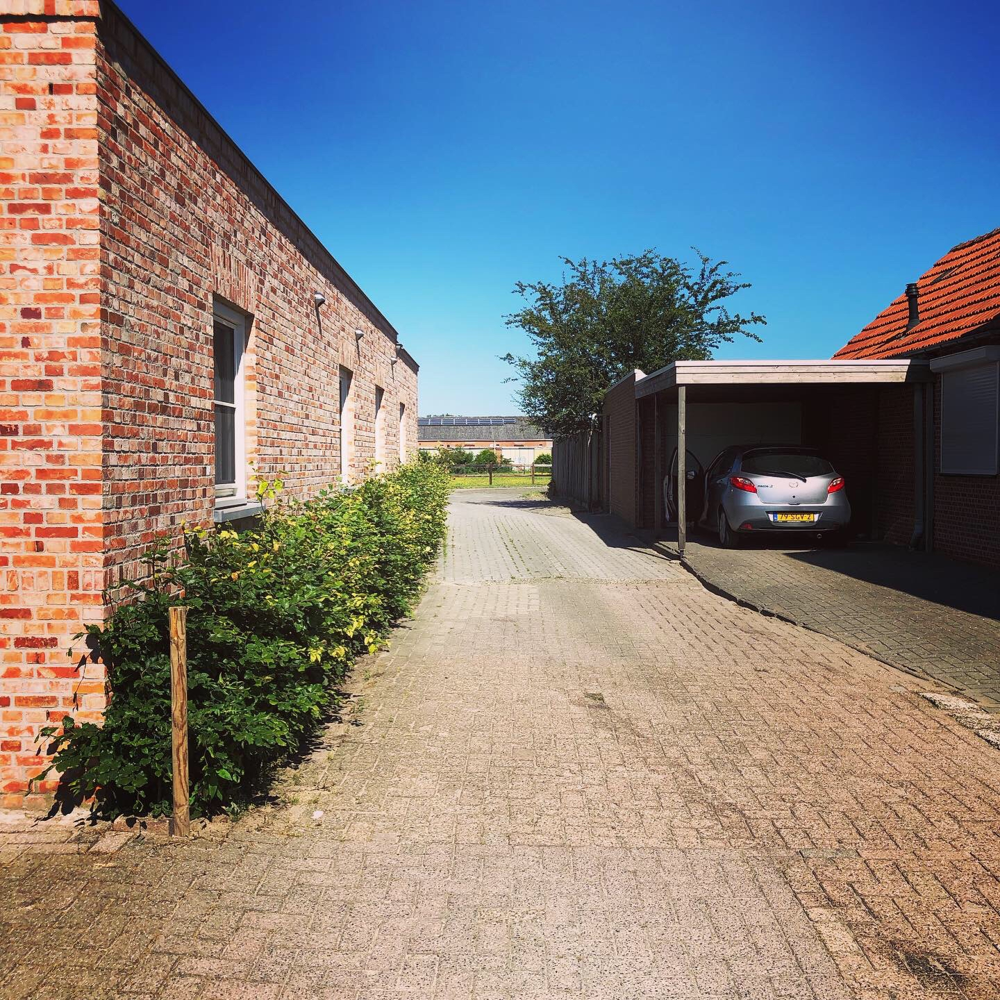
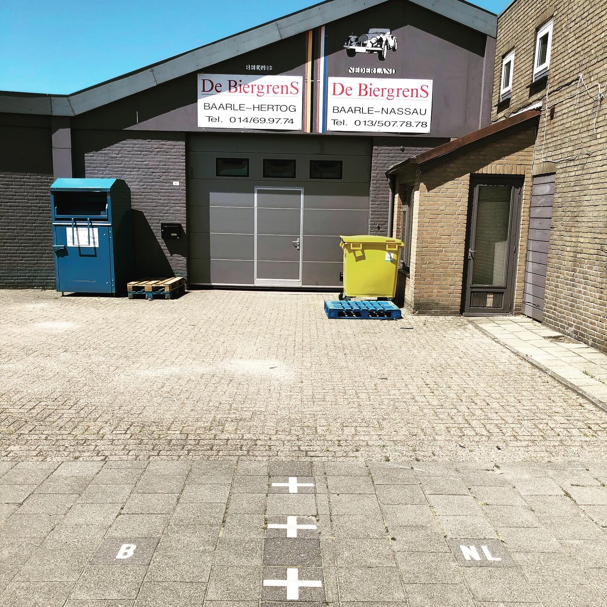
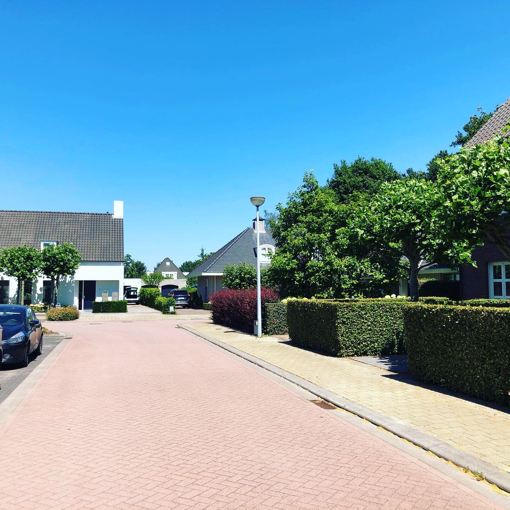
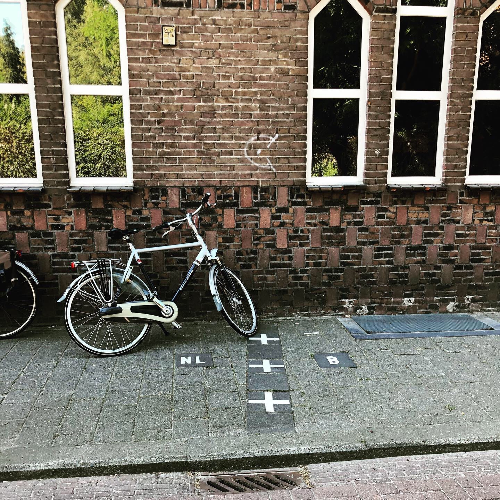

I've been on a
[world tour](https://www.instagram.com/explore/tags/lopoworldtour/) lately,
visiting Singapore, Dublin, London, Paris, and Amsterdam over the course of 3.5
weeks. The coolest thing I've done on this trip is visit the small villages of
[Baarle-Hertog 🇧🇪](https://en.wikipedia.org/wiki/Baarle-Hertog) and
[Baarle-Nassau 🇳🇱](https://en.wikipedia.org/wiki/Baarle-Nassau), the site of one
of the most complicated international borders in the world.

Baarle-Hertog is a collection of parcels within the Netherlands that are
Belgian. These parcels are separated from the main of Belgium, which makes them
[exclaves](https://en.wikipedia.org/wiki/Enclave_and_exclave). These parcels are
also surrounded entirely by the Netherlands, which makes them
[enclaves](https://en.wikipedia.org/wiki/Enclave_and_exclave).

  

More special, and more rare, is that within these Belgian exclaves is another
level of recursion. Within Baarle-Hertog are seven Dutch exclaves. This extra
level of nesting is called a
[counter-exclave](https://en.wikipedia.org/wiki/Enclave_and_exclave#Enclaves_within_enclaves).

To stand at the center of a counter-exclave is a unique experience. There are
not many places on earth where you are surrounded by three nested sets of
concentric national borders.

  

I walked through all seven Dutch counter-exclaves and was surprised at how
uneventful it was. In most of them the border was not even marked. This is the
border of N1, the largest Dutch counter-exclave. As I stood staring at the map
wondering where the border was, I asked a family getting into their car, "Where
is the line? Where is the border?" The man gestured to this gap between his
house and the house to the left and said, "It’s right here! And 50m past my
house is another border. And no one knows!"

  

In N2, the border cuts right through this auto shop, which seems to deal with
this peculiarity by having separate legal entities for its business on either
side of the border.

  

N3 is less than 3000 square meters and contains only a handful of houses. The
only way you'd know you've crossed the border is that the flags on the EU
license plates change as you walk along the street.

  

The border is everywhere in these two villages ...

  

... but it's invisible, too.

  

